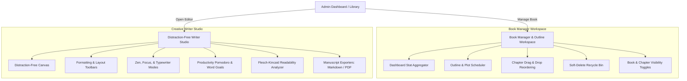

# 💼 Professional Developer Portfolio & Creative Writer's Studio

Welcome to my professional developer portfolio and digital playground! This project is a curated showcase of advanced frontend engineering, custom editor architecture, secure serverless APIs, and creative writing utility suites. 

It functions as both an interactive portfolio demonstrating my software development skills (featuring modern responsive layouts, animation workflows, and custom backend APIs) and a robust, production-grade **Writer's Studio and Digital Library** designed for novelists and content creators.

---

## 🎨 Creative Architecture & Portfolio Showcase

This application demonstrates professional engineering practices in building interactive web ecosystems:
1. **Custom Editor Architectures**: A fully custom Tiptap engine integrating complex paragraph-dimming focus states, page-break computation algorithms, and multi-unit canvas rulers.
2. **State & Sync Synchronization**: Real-time database synchronizations, autosaving debounces, local storage fallback systems, and dynamic state machines.
3. **Advanced Layout Engineering**: Immersive CSS styling including glassmorphism, responsive sidebars, smooth animations (Framer Motion + AOS), and dark/light/sepia contrast-aware themes.
4. **Serverless REST APIs**: Secured microservices deployed via Firebase Cloud Functions utilizing Express routing and custom claims middleware.

---

## 📂 Comprehensive Walkthrough: Admin Panel & Features

The platform includes a secured, authentication-guarded Admin Panel consisting of three core interfaces: the **Books Library**, the **Book Manager / Outline Tracker**, and the **Book Writer Studio**.



---

### 🗂️ 1. Books Library Dashboard (`BooksLibrary.tsx`)
The entryway to the author's backend workspace.
*   **Novel Registration & Metadata Management**: Create, edit, and archive novels. Includes custom classification forms for title, genre, target audience description, and status.
*   **Recycle Bin & Recovery**: Houses soft-deleted books and chapters, preventing accidental data loss by giving authors a one-click restore function or permanent purge capabilities.

---

### 📊 2. Book Manager & Outline Workspace (`BookDetail.tsx`)
Located at [BookDetail.tsx](src/pages/BookDetail.tsx), this workspace manages structural book details and overall project timelines:

*   **Dashboard Stat Aggregations**:
    *   **Word Count Aggregator**: Automatically computes and sums up individual chapter word counts in real time.
    *   **Reading Time Estimator**: Formulates average consumption speed metrics based on overall word count density (e.g. 250 words/min).
    *   **Workflow Distribution Stats**: Displays the number of chapters currently in *Draft*, *In Progress*, *Done*, *Needs Revision*, or *Published* statuses.
*   **Interactive Chapter Reordering**:
    *   Features a responsive drag-and-drop hierarchy panel powered by `@dnd-kit/core` and `@dnd-kit/sortable`.
    *   Provides standard handle grip actions supporting pointer and keyboard coordinates for accessible chapter ordering.
    *   Triggers background API requests to `/chapters/reorder` to immediately update chapter sorting arrays in Firebase.
*   **Side-by-Side Outline & Plot Planner**:
    *   Integrates a hierarchical outline organizer to map out narrative arcs, key sequences, and character introduction milestones.
    *   Each outline note is accompanied by checkbox completion states.
    *   Maintains double-layer synchronicity: outline data falls back to `localStorage` and automatically updates Firebase using a debounced 1.5-second save trigger.
*   **Visibility & Publishing Controls**:
    *   Enables authors to toggle the visibility of the entire book or individual chapters between `Draft` and `Published`.
    *   Updating a chapter's status to `Published` automatically propagates it to the public library reading feed.

---

### ✍️ 3. Distraction-Free Creative Writer Studio (`BookWriter.tsx`)
Located at [BookWriter.tsx](src/pages/BookWriter.tsx), this interface is a comprehensive manuscript-grade drafting studio:

*   **Manuscript Paper Canvas & Ruler Guides**:
    *   Simulates realistic manuscript sheets in the editor canvas, aligning text flow to target dimensions.
    *   **Paper Sizes**: Selectable boundaries for **A4**, **Letter**, and **Legal** page formats.
    *   **Layout Density Adjuster**: Switches between **Compact**, **Comfortable**, and **Spacious** margin padding profiles.
    *   **Multi-Unit Scale Rulers**: Implements dynamic Horizontal, Vertical, and Right ruler scales matching the canvas zoom percentage (50% to 200%).
    *   **Page-Break Calculator**: Contains an automated observer script that measures DOM element bounds, injects page-break spacings, and generates custom headers and page-numbered footers.
*   **Advanced Typography Formatting (Tiptap)**:
    *   Supports standard fonts: Times New Roman, Georgia, Palatino, Arial, Calibri, Helvetica, Courier New, and Consolas.
    *   Includes line spacing guides (Single, 1.5, Double, 2.5), subscript/superscript toggles, drop caps, lists, blockquotes, and dividers.
    *   **Color Swatch Popovers**: Quick swatches for both foreground text and highlight backgrounds.
    *   **Table Construction Grid**: An interactive grid picker allowing authors to define table rows and columns dynamically.
*   **Productivity & Focused Writing Modes**:
    *   **Zen Mode**: Collapses all toolbars and navigation panels for a zero-distraction drafting screen.
    *   **Focus Mode**: Highlights the paragraph currently being edited while dimming all surrounding text block containers.
    *   **Typewriter Scroll Mode**: Pins the active cursor position vertically to the center of the viewport, scrolling the manuscript page automatically as you type.
*   **Live Metrics & Readability Analysis**:
    *   Calculates real-time word count, character density, and total sentence count.
    *   **Flesch-Kincaid Reading Level Engine**: An integrated syllable and text analyzer that scores readability as you type, classifying text into grades (e.g. *5th Grade*, *8-9th Grade*, *College*, *Graduate*).
*   **Autosave & Backup Exporter**:
    *   Synchronizes draft content with Cloud Firestore in the background using a debounced autosave system.
    *   **Offline Document Exporters**: Allows downloading files locally as raw `.txt`, styled `.md` (Markdown), or generating publication-ready PDFs.
*   **Task & Productivity Aggregators**:
    *   **Pomodoro Clock**: An interactive session timer (Play, Pause, Reset, Custom Minutes) to help authors focus. Displays warnings and completion toast alerts.
    *   **Target Word Goals**: Set target word limits per chapter with a visual progress bar indicating completion percentage.

---

## 🔒 Layered Security & Intellectual Property Protection

To safeguard original novels and digital manuscripts from unauthorized copy-pasting, piracy, and cloning, the platform implements a layered security model combining **aggressive client-side anti-theft blocks** with **token-authenticated backend microservices**.

> [!IMPORTANT]  
> All public-facing book reader layouts ([PublicBookDetail.tsx](src/pages/PublicBookDetail.tsx)) feature zero export options. Any print, capture, or download mechanism is blocked or secured using Firebase ID Tokens.

```
       [Public User Request]                 [Admin / Writer Request]
                 │                                      │
                 ▼                                      ▼
    ┌─────────────────────────┐            ┌─────────────────────────┐
    │  Public Reader Page     │            │  Writer Admin Canvas    │
    │  (Anti-Theft Active)    │            │  (Full Access Studio)   │
    └────────────┬────────────┘            └────────────┬────────────┘
                 │                                      │
 ┌───────────────┼───────────────┐                      │
 ▼               ▼               ▼                      ▼
Disable       Block       Blank Prints             Attach Token
Select     Ctrl+C/A/P/S    (@media print)      (?token=Firebase_JWT)
                 │                                      │
                 └───────────────┬──────────────────────┘
                                 │
                                 ▼
                     ┌───────────────────────┐
                     │  Backend API Guard    │
                     │  (checkAdminAuth)     │
                     └───────────┬───────────┘
                                 │
                   ┌─────────────┴─────────────┐
                   ▼                           ▼
            [Token Valid]               [Token Invalid]
            (Allow Export)             (403 Forbidden)
```

### 🛡️ Client-Side Content Protections
1.  **Selection Blocker (`CSS: user-select: none`)**: Standard text highlighting is completely disabled on reading pages, preventing cursor drags from selecting chapter text.
2.  **Context Menu Interceptor**: Right-clicking anywhere within the book canvas is intercepted and disabled, preventing browser tools or text-copy menu commands.
3.  **Keyboard Modifier Blocker**: Keypress listeners monitor modifier combos to prevent common shortcuts:
    *   **Copy & Select All**: Prevents `Ctrl+C` / `Cmd+C` and `Ctrl+A` / `Cmd+A`.
    *   **Save & Print**: Prevents `Ctrl+S` / `Cmd+S` and `Ctrl+P` / `Cmd+P`.
    *   **Developer Inspector**: Blocks `F12` and DevTools configurations (`Ctrl+Shift+I` / `Cmd+Opt+I`, `Ctrl+Shift+J`, `Ctrl+Shift+C`).
    *   *Note: Attempts trigger immediate security toast alerts warning the reader.*
4.  **Print Empty-Out Query (`CSS: @media print`)**: Prevents printing pages or compiling "Save to PDF" documents in the browser. Injected media queries set the `body` container display to `none !important`, outputting blank pages.

### 🔑 Backend API Security (`functions/routes/books.js`)
*   **Authentication Middleware (`checkAdminAuth`)**: Backend microservices for file exports (HTML/PDF formats) are fully guarded. The middleware parses JWT tokens from:
    *   Authorization Bearer Headers (`Bearer <token>`)
    *   URL Query Parameters (`?token=<token>`)
    *   Browser Session Cookies
*   **Firebase Claims Verification**: The middleware validates tokens using the `admin.auth().verifyIdToken(token)` SDK. Only users with valid admin credentials are permitted to download book manuscripts. Public requests or invalid tokens receive a `403 Forbidden` response:
    ```json
    { "error": "Forbidden: Admin access required" }
    ```

---

## ⚡ Intelligent Autosave & Sync Engine

Writing flows require absolute reliability. The Writer's Studio utilizes an advanced double-layer background synchronization system to ensure draft text is never lost:

1.  **State Change Debouncing**: To avoid spamming Firestore with millions of database writes as you type, mutations in both [BookWriter.tsx](src/pages/BookWriter.tsx) (for chapter content) and [BookDetail.tsx](src/pages/BookDetail.tsx) (for master outlines) trigger a **1500ms debouncing timer**. The system waits until the author pauses typing before sending a single coalesced update.
2.  **Dual-Layer Local Backup**: Edits are immediately written to browser `localStorage` keys (`bw-book-<id>-outline`, `bw-bookmarks`, etc.) synchronously. If a network interruption occurs, the client retains the draft buffer, restoring the active workspace state seamlessly on the next session.
3.  **Atomic Document Updates**: Content changes are packed into HTTP `PUT` requests, hitting backend endpoints to update specific Firestore document fields (like `content`, `wordCount`, `updatedAt`, and `outline`) atomically, maintaining low network overhead.

---

## 🆕 Recent Codebase Enhancements & Portfolio Updates

To showcase professional debugging, layout tuning, and security engineering, the following modifications have been implemented in the codebase:

*   **🛡️ Secure Manuscript Export APIs**: Added an authorization validation middleware (`checkAdminAuth`) to backend routes. Requests to HTML/PDF chapter and book downloads are blocked unless authorized with a valid Firebase ID Token (read from authorization headers, cookies, or query parameters).
*   **📖 Proper Status Queries**: Updated database filtering from `done` to `published`, ensuring only chapters officially marked as published appear on the public reader feeds.
*   **🚫 Public Reader Anti-Copy Blocks**: Added absolute `user-select: none` rules, intercepted context-menus (right-click blocks), and intercepted modifier shortcut keys (Ctrl+C, Ctrl+A, Ctrl+S, F12 inspector keys) on public reading pages, warning users with security toasts.
*   **🎨 Dynamic Typography & Contrast Tuning**:
    *   Added **Times New Roman** to the font choice selections, dynamically applying style overrides on the text canvas.
    *   Implemented contrast-aware typography labels across dark, light, and sepia themes. In sepia mode, all menu links and control titles adapt to dark brown (`#5c4938`) for perfect accessibility.
*   **📍 Fixed Desktop Table of Contents Sidebar**: Replaced the sticky TOC container with a `fixed` layout, bypassing parent viewport bugs, and configured the text reading canvas with dynamic paddings (`lg:pl-72` when open, `lg:pl-0` when closed) using smooth Framer Motion-style transition timings.
*   **💾 Local Storage Reader Settings**: Reading preferences (font family, font scale, theme) are initialized from `localStorage` values and saved back to the browser on every change, ensuring settings are remembered on return visits.
*   **⏱️ Auto-Closing Dropdown Menus**: Configured click-outside listeners to automatically collapse active popovers when clicked off-target.

---

## 🛠️ Technology Stack & APIs

*   **Frontend**: React 19, TypeScript, Vite, Tailwind CSS v4, Framer Motion, Lucide Icons, AOS (Animate on Scroll).
*   **Database**: Cloud Firestore (Hierarchical layout: `books` -> `chapters` nested collections).
*   **Backend Functions**: Express routing hosted on Node.js Firebase Functions (`asia-south1`).
*   **Authentication**: Firebase Auth with JWT Claims Verification.

---

## 💻 Setup, Installation, & Deployment

### Prerequisite Environment Variables
Create a `.env` file at the project root to target your backend API base:
```env
VITE_API_URL=https://api-dp2f6yjbbq-el.a.run.app
```

### Installation
1. Install project dependencies:
   ```bash
   npm install
   ```
2. Install backend cloud functions dependencies:
   ```bash
   cd functions
   npm install
   cd ..
   ```

### Run Locally
Launch the local Vite React server:
```bash
npm run dev
```

### Deployment
To push updates to production:
*   **Backend APIs**: `firebase deploy --only functions`
*   **Frontend SPA**: `npm run build && firebase deploy --only hosting`
